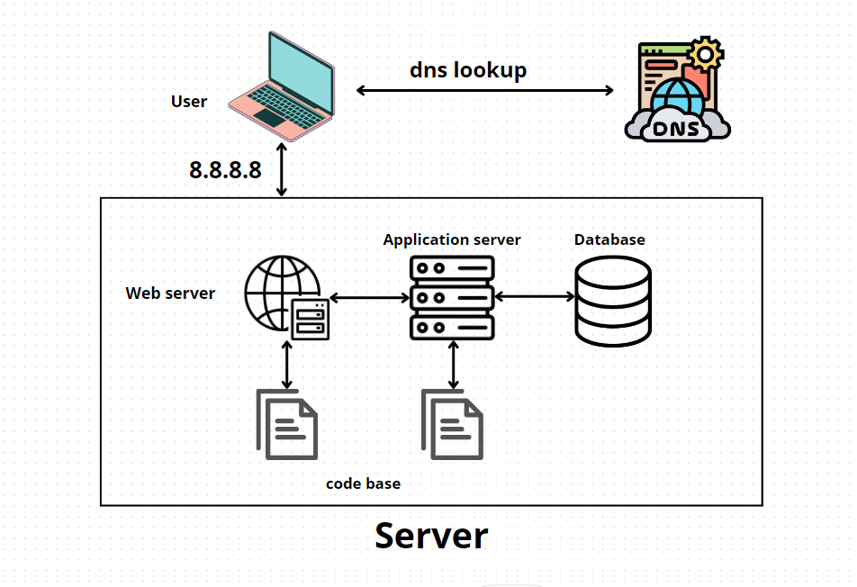

# Web Infrastructure Design

## User Access:

- A user accesses the website by typing "www.foobar.com" in their browser.

## Infrastructure Components:

- **Server:** Hosts all components.
- **Web Server (Nginx):** Receives and manages HTTP requests.
- **Application Server:** Executes the application's logic.
- **Application Files:** Contains the website's codebase.
- **Database (MySQL):** Stores data for the website.
- **Domain Name (foobar.com):** Resolves to the server's IP (8.8.8.8).

## Role Explanation:

- **Server:** Physical or virtual machine hosting and managing all components.
- **Domain Name:** Human-readable alias for the server's IP address.
- **www DNS Record:** Points to the server's IP, a CNAME record type.
- **Web Server:** Manages HTTP requests, serves static content, and handles connections.
- **Application Server:** Executes dynamic code, interfaces between web server and application logic.
- **Database:** Manages, stores, and retrieves website data.
- **Communication Protocol:** Uses HTTP/HTTPS to communicate between the server and the user's computer.

## Issues with this Infrastructure:

- **SPOF (Single Point of Failure):** Entire system failure if the server goes down.
- **Downtime during Maintenance:** Unavailability during code deployments or web server restarts.
- **Scalability Issues:** Inability to handle high incoming traffic.
