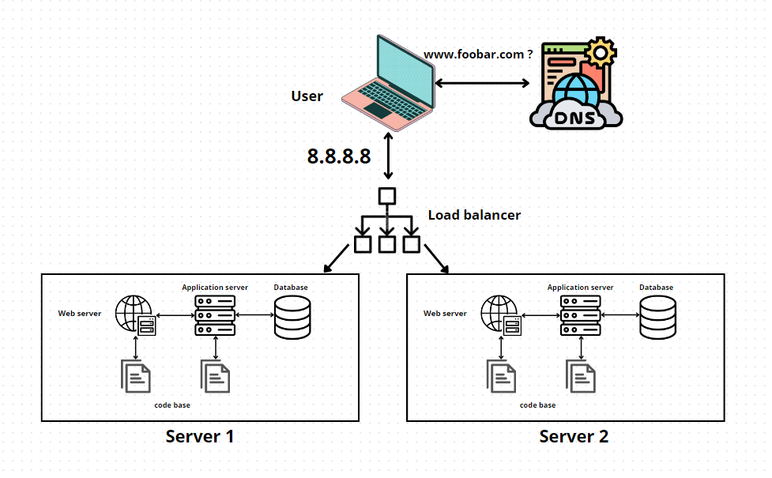

# Distributed Web Infrastructure

## User Access:

- Users access the website by entering "www.foobar.com" in their browsers.

## Infrastructure Components:

- **Load Balancer (HAProxy):** Distributes traffic between multiple servers.
- **Web Servers (Nginx):** Serve web content and manage HTTP requests.
- **Application Servers:** Execute application logic and handle dynamic content.
- **Set of Application Files:** Contains the codebase for the website.
- **Database (MySQL):** Stores and manages website data.

## Specifics about Infrastructure Elements:

- **Additional Elements:**
  - **Load Balancer (HAProxy):** Added to distribute incoming traffic evenly among multiple servers for efficient load handling and redundancy.
- **Load Balancer Configuration:**

  - Utilizes a Round-Robin distribution algorithm, evenly distributing incoming requests among the available servers.

- **Active-Active or Active-Passive Setup:**

  - Implemented an Active-Active setup where all servers actively handle traffic. In contrast, Active-Passive designates one server as active while others are on standby, serving only if the active server fails.

- **Primary-Replica (Master-Slave) Database Cluster:**

  - The Primary-Replica cluster involves a Master node (Primary) and a Slave node (Replica). The Primary node handles write operations, and the Replica nodes mirror data from the Primary node to handle read operations.

- **Difference between Primary and Replica in relation to the Application:**
  - The Primary node accepts write operations, making changes to the database. The Replica node mirrors these changes and handles read operations. Application connects to the Primary node for write operations and can connect to the Replica node for read operations to distribute the load.

## Issues with this Infrastructure:

- **Single Point of Failure (SPOF):**

  - The Load Balancer, each server, and the Database can become SPOFs if not configured for redundancy.

- **Security Issues:**

  - Lack of firewall configuration might expose servers to potential security risks. Lack of HTTPS might compromise data security during transmission.

- **Monitoring:**
  - Absence of monitoring tools could lead to difficulties in identifying and resolving issues promptly.
