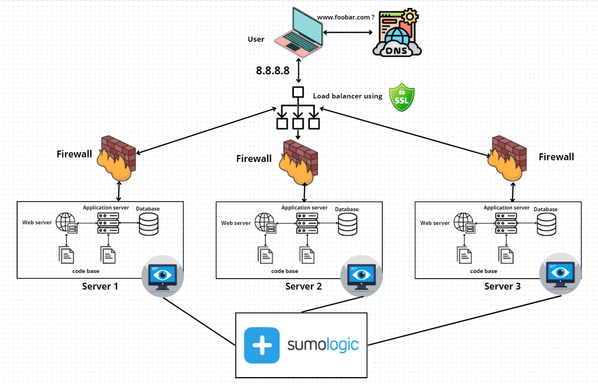

# Secured Web Infrastructure Design

## User Access:

- Users access the website by entering "www.foobar.com" in their browsers.

## Infrastructure Components:

- **Firewalls (3):** Protect and control incoming/outgoing traffic for each server.
- **SSL Certificate:** Enables serving www.foobar.com over HTTPS for encrypted traffic.
- **Monitoring Clients (3):** Collect data for monitoring services (e.g., SumoLogic).

## Specifics about Infrastructure Elements:

- **Why Additional Elements:**

  - **Firewalls:** Added for enhanced security, control over traffic, and defense against unauthorized access.
  - **SSL Certificate:** Required for HTTPS to encrypt traffic, ensuring data security and privacy.
  - **Monitoring Clients:** Used to monitor and collect performance data, system status, and potential issues.

- **Purpose of Firewalls:**

  - Firewalls serve as barriers against unauthorized access, providing a line of defense to prevent malicious traffic and secure the servers.

- **HTTPS Traffic:**

  - Serving traffic over HTTPS ensures data encryption during transmission, safeguarding sensitive information from interception and maintaining user privacy.

- **Monitoring Utility:**

  - Monitoring allows the observation of system health, performance, and security, enabling prompt issue identification and resolution.

- **Data Collection by Monitoring Tool:**

  - Monitoring tools collect various metrics and logs from servers, analyzing them to provide insights into system performance, errors, and security threats.

- **Monitoring Web Server QPS (Queries Per Second):**
  - To monitor the web server's QPS, set up monitoring tools to track incoming queries, resource usage, and server response times.

## Issues with this Infrastructure:

- **SSL Termination at Load Balancer Level:**

  - Terminating SSL at the load balancer level can expose decrypted data, compromising security during internal transmissions.

- **Single MySQL Server Accepting Writes:**

  - Having a single MySQL server capable of accepting writes is a single point of failure; if it fails, write operations cease.

- **Uniform Servers Configuration:**
  - Identical components across servers pose issues. If one fails due to a specific component, others might face similar failures, impacting the entire system.
