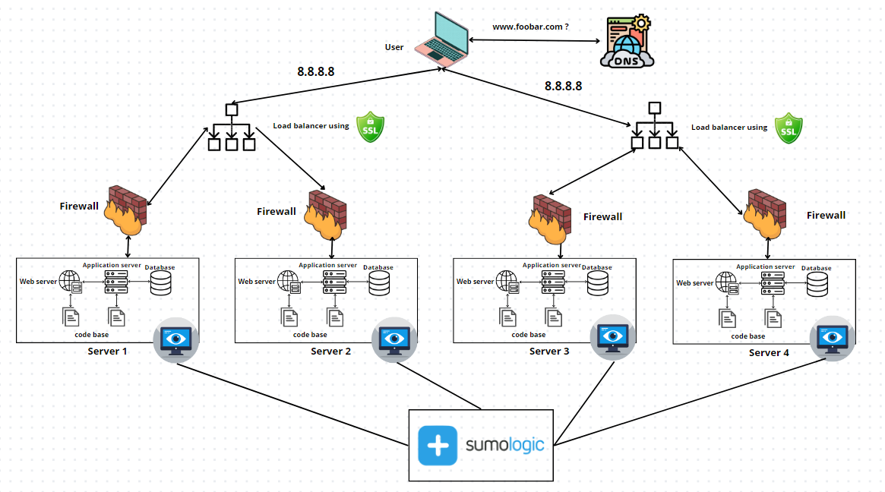

# Split Component Load-Balanced Infrastructure

## Infrastructure Components:

- **Servers (2):**
  - One dedicated server for Load-Balancer (HAProxy).
  - Another server hosting split components: Web Server, Application Server, Database.

## Specifics about Infrastructure Elements:

- **Purpose of Load-Balancer (HAProxy):**
  - The addition of a Load-Balancer (HAProxy) configured as a cluster with the other one helps distribute incoming traffic efficiently among multiple servers to achieve load balancing, enhance performance, and ensure high availability.
- **Split Components on Their Own Server:**

  - Each component, namely Web Server, Application Server, and Database, is placed on its dedicated server to segregate functionalities, provide isolation, and ensure optimized resource allocation for each task.

- **Advantages of Splitting Components:**
  - Isolating components on separate servers enables more focused resource allocation, easier maintenance, and improved security as each component can be individually managed and secured.

## Embedded Image Placeholder:
